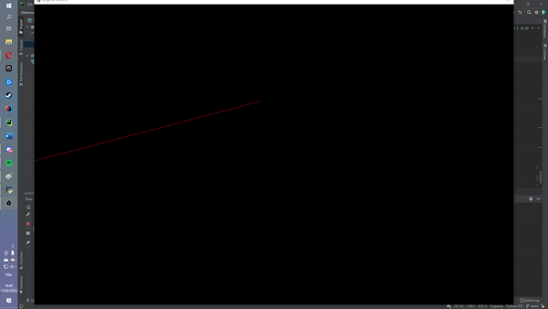
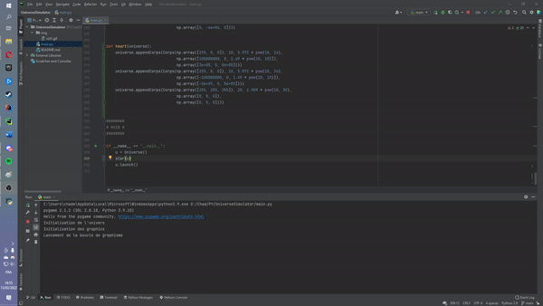

# Universe Simulator  
## Project presentation  
This is a personal small project that I made on february 2022.
This is a simulation of our universe with real Newton Forces.
For this project I used Numpy for matrix calculations and OpenGL for the 3D part (Tkinter for the 2D part but not available anymore).  

## How to use  
Install all dependencies, and launch !  
> 'zqsd' to move in the environment  
> 'space / left ctrl' to move upward and downward
> 'w' to enable history lines, and show XYZ vectors  
> 'x' to pause the simulation (you can still move)
````PYTHON
# System
from math import sqrt
import threading
import sys
import numpy as np
import time

# OpenGL
import pygame as pg
from pygame.locals import *

from OpenGL.GL import *
from OpenGL.GLU import *

from win32api import ShowCursor
````
You can change the preset inside the main function, by default it's solar(u).  
````PYTHON
if __name__ == "__main__":
    u = Universe()
    solar(u)
    u.launch()
````
Here is what preset you can use:
> heart()  
  
> star()  
  

And you can do your own by editing the code !
## Code presentation
````PYTHON
soon
````